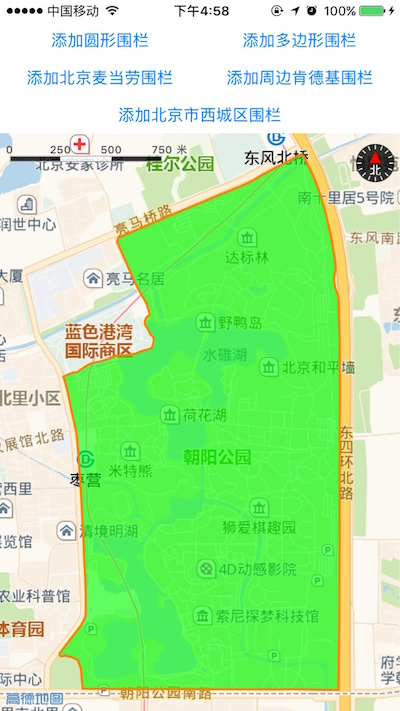
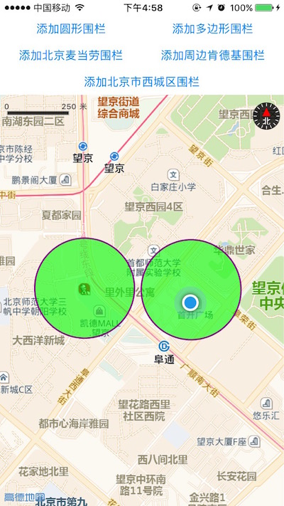
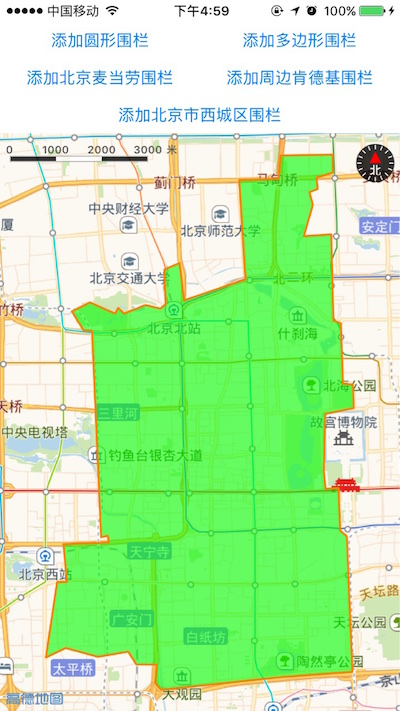

# iOS-location-geofence
iOS地理围栏Demo

## 前述 ##

- 工程是基于iOS定位SDK实现的
- [高德官方网站申请key](http://lbs.amap.com/api/ios-sdk/guide/create-project/get-key/#t1).
- 阅读[地理围栏](http://lbs.amap.com/api/ios-location-sdk/guide/additional-func/local-geofence/#creat-geofence).
- 查阅[参考手册](http://a.amap.com/lbs/static/unzip/iOS_Location_Doc/index.html).

## 使用方法 ##

- 运行demo请先执行pod install --repo-update 安装依赖库，完成后打开.xcworkspace 文件
- 如有疑问请参阅[自动部署](http://lbs.amap.com/api/ios-sdk/guide/create-project/cocoapods/).

## demo运行效果图 ##







## 核心类／接口 ##

| 类    | 接口  | 说明   |
| -----|:-----:|:-----:|
| AMapGeoFenceManager | 	- (void)addCircleRegionForMonitoringWithCenter:(CLLocationCoordinate2D)center radius:(CLLocationDistance)radius customID:(NSString *)customID | 添加一个圆形围栏 |
| AMapGeoFenceManager | 	- (void)addPolygonRegionForMonitoringWithCoordinates:(CLLocationCoordinate2D *)coordinates count:(NSInteger)count customID:(NSString *)customID | 根据经纬度坐标数据添加一个闭合的多边形围栏 |
| AMapGeoFenceManager | 	- (void)addKeywordPOIRegionForMonitoringWithKeyword:(NSString *)keyword POIType:(NSString *)type city:(NSString *)city size:(NSInteger)size customID:(NSString *)customID | 根据要查询的关键字，类型，城市等信息，添加一个或者多个POI地理围栏 |
| AMapGeoFenceManager | 	- (void)addAroundPOIRegionForMonitoringWithLocationPoint:(CLLocationCoordinate2D)locationPoint aroundRadius:(NSInteger)aroundRadius keyword:(NSString *)keyword POIType:(NSString *)type size:(NSInteger)size customID:(NSString *)customID | 根据要查询的点的经纬度，搜索半径等信息，添加一个或者多个POI围栏 |
| AMapGeoFenceManager | 	- (void)addDistrictRegionForMonitoringWithDistrictName:(NSString *)districtName customID:(NSString *)customID | 根据要查询的行政区域关键字，添加一个或者多个行政区域围栏 |
| AMapGeoFenceManagerDelegate | - (void)amapGeoFenceManager:(AMapGeoFenceManager *)manager didAddRegionForMonitoringFinished:(NSArray <AMapGeoFenceRegion *> *)regions customID:(NSString *)customID error:(NSError *)error | 添加地理围栏完成后的回调，成功与失败都会调用 |
| AMapGeoFenceManagerDelegate | - (void)amapGeoFenceManager:(AMapGeoFenceManager *)manager didGeoFencesStatusChangedForRegion:(AMapGeoFenceRegion *)region customID:(NSString *)customID error:(NSError *)error | 地理围栏状态改变时回调，当围栏状态的值发生改变，定位失败都会调用 |

## 核心难点 ##

`Objective-C`

```
self.geoFenceManager.activeAction = AMapGeoFenceActiveActionInside | AMapGeoFenceActiveActionOutside | AMapGeoFenceActiveActionStayed; //监听进入、退出、停留事件，默认值为AMapGeoFenceActiveActionInside

[self.geoFenceManager removeAllGeoFenceRegions];  //移除所有已经添加的围栏，如果有正在请求的围栏也会丢弃

[self.geoFenceManager addKeywordPOIRegionForMonitoringWithKeyword:@"麦当劳" POIType:@"快餐厅" city:@"北京" size:2 customID:@"poi_keyword"]; //POI关键词

[self.geoFenceManager addAroundPOIRegionForMonitoringWithLocationPoint:coordinate aroundRadius:5000 keyword:@"肯德基" POIType:@"快餐厅" size:2 customID:@"poi_around"]; //POI周边

[self.geoFenceManager addDistrictRegionForMonitoringWithDistrictName:@"西城区" customID:@"district_1"];  //行政区域

//地理围栏状态改变时回调，当围栏状态的值发生改变，定位失败都会调用
- (void)amapGeoFenceManager:(AMapGeoFenceManager *)manager didGeoFencesStatusChangedForRegion:(AMapGeoFenceRegion *)region customID:(NSString *)customID error:(NSError *)error {
    if (error) {
        NSLog(@"status changed error %@",error);
    }else{
        NSLog(@"status changed %@",[region description]);
    }
}


```


`Swift`

````
敬请期待

````
